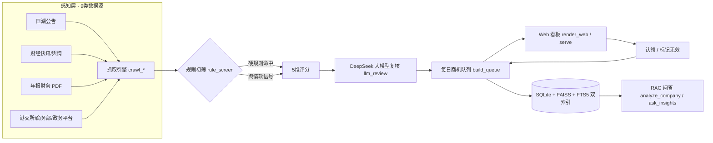

# 工银汇智 · 企业外汇智能体
## ——基于 Pi Coding Agent 的企业外汇需求商机雷达（实习项目汇报）

> **汇报人**：＿＿＿＿（华南师范大学　信息与通信工程 / 计算机相关专业）　
> **实习部门**：中国工商银行深圳分行 · 金融市场部（人工智能创新组）　
> **报告日期**：2026 年 8 月

---

## 摘要

本项目面向金融市场部客户经理"手动刷资讯、凭经验猜客户"的获客痛点，基于 **Pi Coding Agent** 打造了一款企业外汇智能体——**工银汇智（ICBC HuiZhi Agent）**：自动抓取上市公司公告、财经舆情、年报财务等公开数据，用「业务规则 + 大模型理解」双重过滤，每日输出**可认领、可溯源、带营销建议**的外汇商机队列，并支持在对话界面中直接提问、深度分析、一键打开公告原文。

**核心成果（截至 2026-08-05）**：

| 指标 | 数值 |
|---|---|
| 数据源 | 9 类（巨潮、新浪、东财 7×24、同花顺直播、港交所、商务部、广东省政务平台等） |
| 公告累计入库 | 1,926 条 |
| 单日商机队列 | 118 条（2026-08-05，覆盖广东 9 城） |
| 公告正文语料 | 30 篇 / 119 个证据块（RAG） |
| 企业档案 | 19 家（法人/注册地址/注册资本等） |
| Pi 工具 | 11 个，一句话触发全流程 |
| 交付形态 | 引擎仓库 + Web 看板 + 桌面端（clone 即用） |

---
## 一、项目背景：获客全凭交易员自己判断

通过对金融市场部交易员的访谈，我们识别出当前外汇获客的核心痛点：**信息获取靠人、商机判断靠经验、输出无固定产出**。

```
交易员现状：自己刷 Wind/网页 → 凭业务经验猜“哪家公司在走出去、可能有结售汇需求”
→ 回行内系统查是否本行客户 → 自己上门营销
```

- 交易员一半时间跑客户、一半时间做交易，客户以中大型企业为主（单笔结售汇约 500 万美元）；
- 8 大痛点中，**“Wind 资讯筛选、拜访前准备、拜访后方案”**三个环节与信息获取强相关，是人力消耗最大、最值得自动化替代的部分；
- 一句话业务逻辑：**“只要客户走出去，必然有结售汇需求，差别只在哪家银行做；谁先一步主动去聊，谁就先入为主。”**

本项目切入的正是“信息获取 → 商机判断 → 营销建议”这一链路，把人工环节替换为程序化、可验证的自动化流水线。

## 二、项目定位：企业外汇智能体

**定义**：面向银行对公外汇业务的 AI 智能体——自动感知外部信息（公告/舆情/财报），结合业务规则与大模型理解识别企业外汇需求，支持对话交互进行查询、分析与建议输出。

**为什么配得上“智能体”（Agent）**：

| 能力 | 本项目对应 |
|---|---|
| 感知（Perceive） | 9 类数据源自动抓取：公告、财经快讯、年报财务、政府公示等 |
| 思考（Think） | 规则初筛 + DeepSeek 语义复核，5 维评分判断商机 |
| 行动（Act） | 在对话界面直接提问、查队列、生成拜访建议、认领商机 |
| 闭环（Loop） | 每日自动运行，结果沉淀为队列，认领/标记无效形成反馈 |

**重要澄清——这不是量化交易**：量化交易是拿自有资金 + 数学模型 + 自动下单赚价差；本项目是**帮客户经理找线索、做服务**，不碰资金、不下单，成败看线索准确率而非收益率。一句话：**量化是自己下场打牌赢钱；本项目是帮销售找出谁想打牌、推荐怎么服务他。**

## 三、系统总体设计

**架构（感知 → 思考 → 行动 → 闭环）**：



**主链路（一句话触发）**：`crawl_cninfo / crawl_news`（抓取）→ `rule_screen`（初筛+评分）→ `review_opportunity`（大模型复核）→ `build_daily_queue`（队列）→ `render_web`（看板）→ `start_server`（预览）→ `claim_opportunity / mark_invalid`（闭环反馈）。

**技术栈**：Python 3.10+（引擎）· SQLite（FTS5 trigram 全文索引）· 百炼 text-embedding-v4（1024 维）+ FAISS（向量检索）· DeepSeek（复核与生成）· Pi Coding Agent（TypeScript 扩展，工具编排）· Next.js（pi-web 桌面端）· 静态 HTML 看板（零依赖可双击打开）。

## 四、核心功能总览（12 项，全部已实现可演示）

| # | 功能 | 一句话说明 | 关键指标 |
|---|---|---|---|
| 1 | 多数据源情报感知 | 9 类数据源自动抓取公告/舆情/财报/政务信息 | 公告库 1,926 条，抓取失败自动样例兜底 |
| 2 | 规则初筛 + 5 维评分 | 广东企业 + 外汇套保关键词 + 45 天窗口，事件可信度/资金体量/时效性/覆盖度/完整度评分 | 权重 0.25/0.20/0.20/0.20/0.15 |
| 3 | DeepSeek 大模型复核 | 逐条生成证据摘要、已知/未知事实、沟通问题、复核分 | 无 Key 自动降级，流程不断 |
| 4 | 每日商机队列 + 潜在业务推断 | 评分排序输出公司/城市/分数/标签，推断汇率避险/对外收付款/跨境结算 | 单日 118 条，覆盖广东 9 城 |
| 5 | 年报财务引擎 | 从年报 PDF 提取汇兑损益等外汇指标，预估业务规模 | 看板一键“更新”实时抓取 |
| 6 | 可视化看板（双视图） | 商机雷达（队列+详情）+ 资讯中心（公告+舆情检索） | 证据可点击、认领/标记无效持久化 |
| 7 | Pi Agent 对话式编排 | 11 个工具，一句话触发全流程，聊天窗口实时展示执行过程 | `/radar` 一键跑通 |
| 8 | 桌面端 pi-web | 定制 ICBC 品牌，clone 即用 | 中文教程 + DeepSeek 配置向导 |
| 9 | 企业档案自动解析 | 年报“公司信息”块解析法人/注册地址/注册资本等 8 字段 | 19 家已建档 |
| 10 | RAG 语料构建 | Top 队列公告 PDF 自动下载、正文提取入库 | 30 篇 / 119 证据块 |
| 11 | 混合检索引擎 | FTS5 BM25 + 百炼向量 + RRF(k=60) 融合，中文子串/语义双路 | 公司名自动限定范围 |
| 12 | 证据级智能问答 | 提问 → 检索证据 → DeepSeek 带 [来源N] 引用回答 | [来源N] 可点击打开原文 PDF |

## 五、技术亮点

1. **Pi Coding Agent 扩展编排**：把业务流水线封装为 11 个可复用工具 + Skill 业务知识 + workflow 流程编排，用户用自然语言一句话触发，无需记命令；
2. **规则 + 大模型双重筛选**：硬规则保证召回（广东 + 套保 + 45 天），大模型复核保证精度（证据摘要、沟通问题），两者互补且各自可降级；
3. **RAG 证据级问答**：公告正文 → 分块（800 字/块、120 字重叠）→ 百炼 embedding（1024 维）+ FAISS + FTS5 双索引 → RRF 融合 → DeepSeek 带引用生成，回答每句话都可溯源；
4. **一键溯源**：回答内 [来源N] 直接点击打开巨潮原文 PDF，保证“结论可验证、不编造”；
5. **稳健性设计**：抓取失败自动回退样例数据并标注来源、缺 Key 自动降级、中文路径下 FAISS 索引封装中转，演示永不中断；
6. **交付即用**：引擎 + 看板 + 桌面端全部进同一个 GitHub 仓库，clone 后配置 API Key 即可运行。

## 六、成果与演示数据（2026-08-05 一次真实运行）

**全链路数据**：抓取公告 186 条 + 舆情信号 9 条 → 规则初筛命中 51 条 → DeepSeek 复核 → 生成商机队列 **118 条**。

**区域分布**（广东 9 城）：深圳 70 · 广州 16 · 珠海 8 · 东莞 7 · 佛山 5 · 江门 4 · 汕头 4 · 韶关 3 · 揭阳 1。

**今日商机 TOP 榜（按评分）**：

| # | 公司 | 城市 | 分数 | 标签 |
|---|---|---|---|---|
| 1 | 东鹏饮料 | 深圳 | 77 | 外汇与套保、币种待核实 |
| 2 | 燕麦科技 | 深圳 | 77 | 外汇与套保、币种待核实 |
| 3 | 海大集团 | 广州 | 77 | 外汇与套保、币种待核实 |
| 4 | 鸿合科技 | 深圳 | 75 | 外汇与套保、境外投资/子公司 |
| 5 | 劲拓股份 | 深圳 | 75 | 外汇与套保、币种待核实 |
| 6 | 特发信息 | 深圳 | 75 | 外汇与套保、境外投资/子公司 |
| 7 | 东鹏饮料 | 深圳 | 73 | 外汇与套保、币种待核实 |
| 8 | 海大集团 | 广州 | 73 | 外汇与套保、币种待核实 |
| 9 | 一品红 | 广州 | 72 | 外汇与套保、币种待核实 |
| 10 | 领益智造 | 江门 | 72 | 外汇与套保、币种待核实 |

**RAG 问答示例**：“帮我分析东鹏饮料的外汇需求” → 输出核心结论（套期保值、10 亿合约上限、1 亿保证金、2026-07-31 公告）+ 5 条带 [来源N] 引用的依据 + 4 条拜访建议，点击 [来源N] 直接打开巨潮原文 PDF 验证。

## 七、实习收获与思考

1. **把业务语言翻译成工程问题**：从“交易员怎么找客户”访谈出发，一步步拆成数据源 → 筛选规则 → 评分 → 展示 → 反馈的产品链路，学会先定义问题再动手；
2. **“规则 + 大模型”不是二选一**：硬规则保证可解释和召回，大模型补语义理解和文本生成，两者配合（规则初筛 → LLM 复核）比单用任一更稳、更省成本；
3. **RAG 的价值在“可溯源”**：金融场景结论必须能验证，混合检索 + [来源N] 引用让 AI 回答从“可信”到“可验证”；
4. **Agent 不是炫技**：Pi Coding Agent 的价值在于把流水线变成可对话、可编排、可复用的工具，稳定交付优先于花哨功能。

## 八、后续展望

- **结构化查询工具**：query_opportunities / queue_stats（按公司/城市/分数/标签查数与统计）；
- **公告正文增量抓取**：从 Top30 扩展到全部队列公司，并接入单公司深度分析一键生成拜访材料；
- **行内数据打通**：对接 GC 系统判断是否存量客户、归属支行（当前覆盖度维度为占位值）；
- **非上市企业加深**：扩大舆情与政务数据源覆盖面，做浅覆盖商机。

## 附录：3 分钟演示路径（建议）

1. **对话触发**：在 pi-web 输入“跑一遍企业外汇需求商机雷达”，展示 11 个工具按序执行；
2. **看板**：打开 http://127.0.0.1:8000 ，展示商机队列 → 点击东鹏饮料 → 企业档案/触发事件/潜在业务/年报数据/判断依据；
3. **深度问答**：输入“帮我分析东鹏饮料的外汇需求”，展示结论 + 可点击 [来源N] 溯源；
4. **闭环**：认领一条商机 → 刷新看板看状态变化。

> 全部代码开源：https://github.com/mountainyldc/ICBC-HuiZhi-Agent （clone → 配置 DeepSeek/百炼 API Key → 即用）

