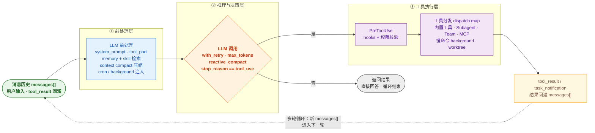

# Claude Code Agent 底层循环原理图（mermaid 版）

> 用途：面试讲解 / PPT 架构页。渲染图见 `docs/claude-code-agent-loop.png`（横版，可直接插入 PPT）。

## 图（mermaid 源码，可在 GitHub / mermaid.live 直接渲染）

## 一分钟讲解词（面试用）

1. **入口**：所有输入（用户消息、工具结果）统一进入 `messages[]` 消息历史。
2. **① 前处理层**：组装 system_prompt 与工具池，注入 memory/skill 检索结果，做上下文压缩（compact），并注入定时/后台任务提醒。
3. **② 推理与决策层**：调用 LLM（带重试、token 上限、响应式压缩），核心判断 `stop_reason == tool_use`：
   - **否** → 直接返回最终回答，循环结束；
   - **是** → 进入工具执行。
4. **③ 工具执行层**：先过 PreToolUse hooks + 权限校验，再经 dispatch map 分发到 内置工具 / Subagent / Team / MCP / 慢命令 background / worktree。
5. **结果回灌**：`tool_result / task_notification` 作为新消息追加进 `messages[]`，回到前处理层，进入下一轮——直到模型不再请求工具、直接回答为止。

## 对应到本项目

- 本项目 Pi 扩展的 11 个工具就是「工具分发」的实例化；
- PreToolUse 对应 Pi 的 hooks 机制（权限/校验）；
- memory + skill 对应 Pi 的 Skills 机制；context compact 对应长会话上下文压缩。

