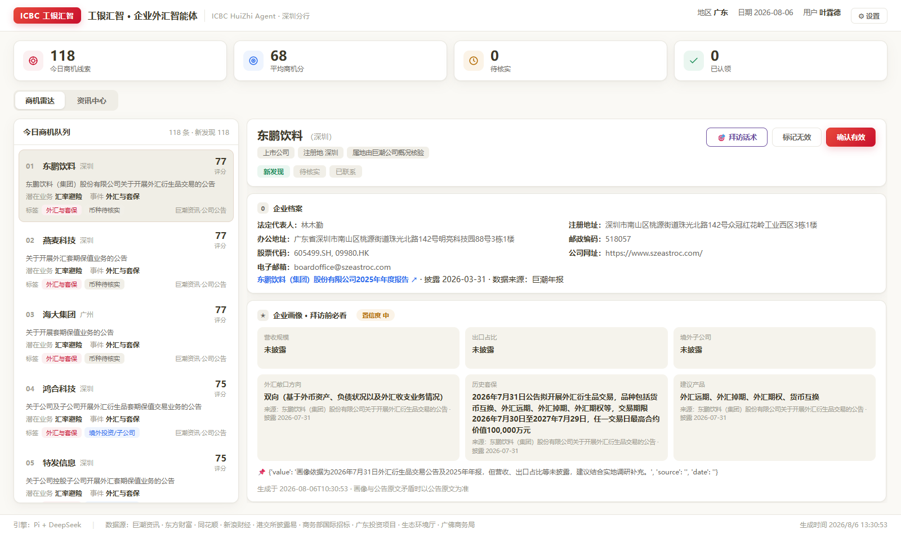
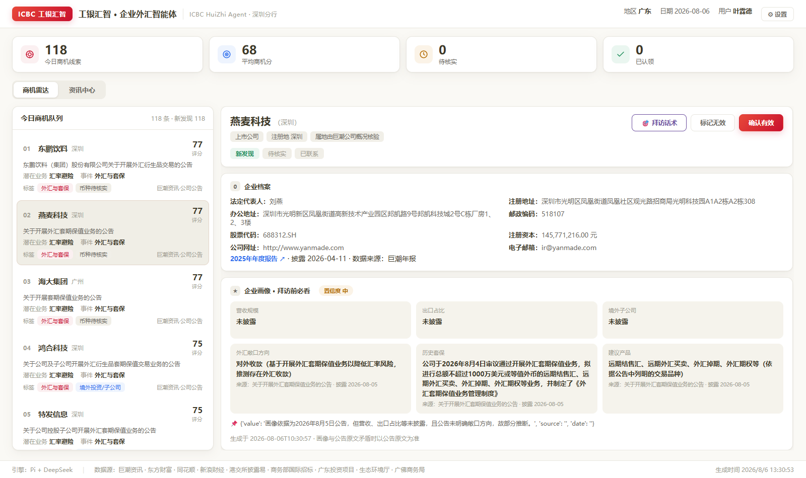
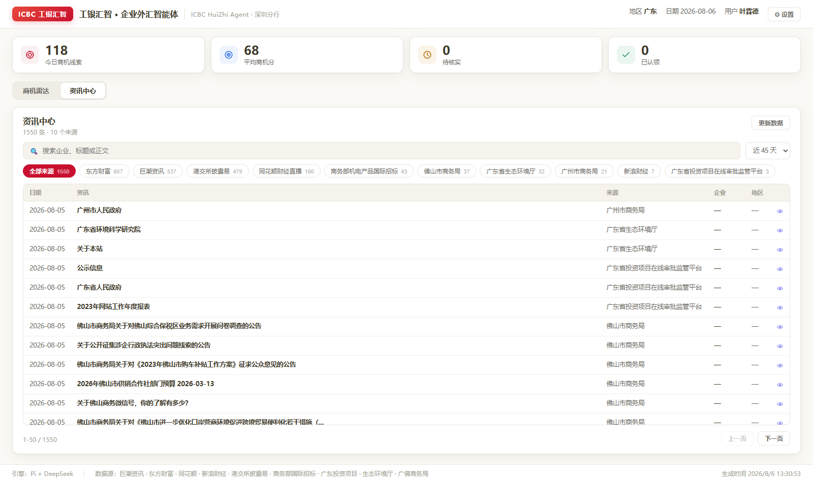

# HuiZhi-Agent — 工银汇智 · 企业外汇智能体（Pi Agent 编排）

基于 Pi Coding Agent 的商机雷达：自动抓取公开数据 → 规则初筛（广东企业 + 外汇套保 + 45 天）
→ 5 维评分 → DeepSeek 大模型复核 → 生成每日商机队列 → 渲染 Web 页面 → 认领 / 标记无效。
页面提供**商机雷达**（队列 + 详情 + 潜在业务判断 + 最新年报数据 + 沟通重点 + **企业画像卡**）与**资讯中心**
（搜索 / 来源筛选 / 时间窗口 / 分页）两个视图。2026-08-06 新增：看板**设置**（规则过滤词/排除词/时间窗口）、
**跨轮次会话记忆**、**按需实时 Web 搜索**、**意图路由 dispatch**，Pi 工具扩展至 18 个。数据源：巨潮资讯 · 东方财富 7x24 · 同花顺财经直播 · 新浪财经 · 港交所披露易 · 商务部机电产品国际招标 · 广东省投资项目在线审批监管平台 · 广东省生态环境厅 · 广州/佛山市商务局。

## 页面截图

| 商机雷达（队列 + 详情） | 商机详情（企业档案卡） | 资讯中心 |
| --- | --- | --- |
|  |  |  |

## 快速开始（clone 即用）

```bash
# 1. 克隆
git clone https://github.com/mountainyldc/HuiZhi-Agent.git
cd HuiZhi-Agent

# 2. 依赖（Python 3.10+）
pip install -r requirements.txt        # requests / openai / pyyaml / pypdf

# 3. 配置环境变量（DeepSeek 复核，缺省自动跳过）
set DEEPSEEK_API_KEY=sk-xxx

# 4. 跑全流程（等价于让 Pi 依次调用 9 个工具）
python engines/crawl_cninfo.py          # ① 巨潮公告（失败回退样例）
python engines/sina_news.py             # ② 新浪财经 7x24 快讯（舆情软信号）
python engines/eastmoney_news.py        # ③ 东方财富 7x24 快讯（舆情软信号）
python engines/crawl_em_feed.py         # ③b 东方财富 7x24 全量快讯（资讯中心主力）
python engines/crawl_ths.py             # ③c 同花顺财经直播（资讯中心）
python engines/crawl_hkex.py            # ③d 港交所披露易（资讯中心）
python engines/crawl_mofcom.py          # ③e 商务部机电产品国际招标（资讯中心）
python engines/crawl_gov_gd.py          # ③f 生态环境厅/广佛商务局/广东投资项目（资讯中心）
python engines/rule_screen.py --reset   # ④ 规则初筛 + 5 维评分 + 潜在业务推断
python engines/llm_review.py --all      # ⑤ DeepSeek 复核
python engines/build_queue.py           # ⑥ 生成今日队列（含 biz / evidence_url）
python engines/render_web.py            # ⑦ 渲染 web/index.html

# 4.5 RAG 证据级问答（可选，需 DASHSCOPE_API_KEY；缺省仅 BM25 关键词检索）
python engines/ingest_docs.py           # 公告正文 PDF -> 文本入库（Top30 公司）
python engines/build_profiles.py        # 企业档案：年报公司信息 -> 看板「企业档案」卡片
python engines/index_docs.py            # 分块 + Embedding(百炼) + FAISS + FTS5
python engines/retrieve.py --query "外汇套保"     # 混合检索（BM25+向量 RRF 融合）
python engines/rag_answer.py --query "帮我分析东鹏饮料的外汇需求"  # 带 [来源N] 引用回答
python engines/build_insights.py --top 20        # 企业画像卡（营收/出口/敞口方向/历史套保/建议产品）
python engines/web_search.py --query "最近外汇管理局有什么新政策"  # 实时联网搜索（带来源链接）
python engines/dispatch.py --query "帮我分析东鹏饮料的外汇需求"    # 意图路由（动态规划）
python engines/memory.py                         # 查看/清除会话记忆（--clear 清除）

# 5. 查看（推荐演示方式：启动服务，认领/标记无效可持久化，资讯中心/年报可在线更新）
python engines/serve.py                 # 打开 http://127.0.0.1:8000
```

> 服务启动时若数据库为空，会自动用 `data/crawled/` 下已有数据重建队列并渲染，无需手动跑全流程。
> 静态模式：直接双击 `web/index.html`（状态仅本次会话生效，年报/资讯需经 serve.py 访问）。

## 页面功能

- **商机雷达**：今日商机队列（评分排序）→ 点击查看详情：**企业档案**（法定代表人/注册地址/
  股票代码/邮箱等，来源年报）/ 触发事件 / 潜在业务判断（汇率避险 / 对外付款 / 对外收款 /
  跨境结算）/ **最新年报数据**（从巨潮年报 PDF 提取汇兑损益等指标，可点「更新」实时抓取）/
  建议沟通重点 / 判断依据 / 商机评分。
- **资讯中心**：公告 + 舆情聚合检索，支持关键词搜索、来源标签筛选、时间窗口、分页，
  「更新数据」一键重跑爬虫 + 筛选 + 渲染。
- 认领 / 标记无效：通过 `serve.py` 持久化到 SQLite。

## Pi Web（桌面端）用法

Pi Web 已整合进本仓库的 `../pi-web`（已定制品牌标识，含中文快速开始与 DeepSeek 配置教程）：

```bash
cd ../pi-web
npm install
npm run build
npm start            # 打开 http://127.0.0.1:30141
```

1. 打开 http://127.0.0.1:30141 ，在 Models 面板配置 DeepSeek（Base URL `https://api.deepseek.com` + API Key + 模型 `deepseek-chat`）
2. 左侧 `Select project...` 选择本仓库目录，聊天框输入 **`跑一遍企业外汇需求商机雷达`**
3. 流程跑完后另开终端：
   ```bash
   cd HuiZhi-Agent
   python engines/serve.py   # 打开 http://127.0.0.1:8000 看商机队列
   ```

## Pi Agent 集成

```bash
# 加载扩展（注册工具 + /radar 命令）
pi -e ./extensions/huizhi-agent.ts

# 在 Pi 中说一句话跑全流程：
#   "跑一遍企业外汇需求商机雷达"
# 或手动调用工具：
#   crawl_cninfo → rule_screen → review_opportunity(all=true)
#   → build_daily_queue → render_web → start_server
#   → claim_opportunity / mark_invalid
# RAG 问答（证据级，带 [来源N] 引用）：
#   analyze_company(company=东鹏饮料)   → 单公司深度分析
#   ask_insights(question=为什么东鹏排第一) → 自由提问
# 新功能工具：
#   company_insight(company=东鹏饮料)   → 企业画像卡（拜访前必看）
#   web_search(query=最近外汇管理局有什么新政策) → 实时联网搜索
#   memory_status / clear_memory        → 跨轮次记忆查看/清除
#   dispatch(query=...)                 → 意图路由，规划工具链
# 记忆说明：分析过某公司后，追问「那它的子公司呢」会自动指代上一家公司。
```

扩展安装到全局：复制 `extensions/huizhi-agent.ts` 到 `~/.pi/agent/extensions/`。

## 目录结构

```
extensions/huizhi-agent.ts   # Pi 扩展：工具 + /radar 命令
skills/huizhi-agent/SKILL.md # 业务知识 + 工具用法
skills/workflow/SKILL.md      # 全流程编排指令
engines/
  crawl_cninfo.py     # ① 巨潮公告抓取（关键词+45天，失败回退样例）
  sina_news.py        # ② 新浪财经 7x24 快讯 -> 舆情软信号
  eastmoney_news.py   # ③ 东方财富 7x24 快讯 -> 舆情软信号
  crawl_em_feed.py    # ③b 东财 7x24 全量快讯（资讯中心，含外汇信号标记）
  crawl_ths.py        # ③c 同花顺财经直播（资讯中心）
  crawl_hkex.py       # ③d 港交所披露易（资讯中心）
  crawl_mofcom.py     # ③e 商务部机电产品国际招标（资讯中心）
  crawl_gov_gd.py     # ③f 生态环境厅/广佛商务局/广东投资项目（资讯中心）
  rule_screen.py      # ④ 规则初筛 + 5 维评分 + infer_biz 潜在业务推断
  llm_review.py       # ⑤ DeepSeek 复核（证据摘要/沟通问题/复核分）
  build_queue.py      # ⑥ 今日商机队列快照（含 biz / evidence_url）
  fetch_financials.py # ⑦ 年报引擎：巨潮年报 PDF -> 汇兑损益等外汇指标
  ingest_docs.py      # RAG-1 公告正文 PDF -> 文本入库 documents
  build_profiles.py   # RAG-2 企业档案：年报公司信息块解析 -> company_profiles
  index_docs.py       # RAG-3 分块 + 百炼 Embedding -> FAISS + FTS5
  retrieve.py         # RAG-4 混合检索：FTS5 BM25 + FAISS 向量 -> RRF 融合
  rag_answer.py       # RAG-5 证据拼 Prompt -> DeepSeek -> 带 [来源N] 引用回答（支持 --remember/--with-memory）
  build_insights.py   # 企业画像：公告+年报+舆情 -> DeepSeek -> company_insights 画像卡
  web_search.py       # 实时搜索：Exa(mcporter) -> so.com -> 降级提示，结果带来源链接
  dispatch.py         # 意图路由：问法 -> 工具链（规则判断，可解释）
  memory.py           # 跨轮次记忆：最近分析公司/关注区域（可查看/清除）
  settings.py         # 看板设置：关键词/排除词/时间窗口持久化 data/settings.json
  render_web.py       # ⑧ 渲染页面（模板引擎：engines/web_template.html）
  serve.py            # ⑨ 演示服务：/action 认领、/financials 年报、/news 资讯中心
  actions.py          # 认领/推进/标记无效 CLI
  store.py            # SQLite 存储层（公告/商机/复核/资讯搜索）
  web_template.html   # 页面模板（苹果风 UI，含商机雷达 + 资讯中心两个视图）
  common.py           # 配置与路径
data/               # 抓取结果 / 财务缓存 / 快照 / 样例（db 不入库）
config.yaml         # 地区/关键词/窗口/评分权重/LLM 配置
```

## 接口一览（serve.py）

| 路由 | 方法 | 说明 |
| --- | --- | --- |
| `/` | GET | 渲染后的商机雷达页面 |
| `/action` | POST | 认领 / 标记无效（持久化 + 重建队列） |
| `/financials?company=东鹏饮料` | GET | 查询年报缓存 |
| `/financials/update` | POST | 强制抓取年报 PDF 并解析指标 |
| `/news?q=&source=&days=&page=&page_size=` | GET | 资讯中心检索（搜索/来源/时间/分页） |
| `/news/update` | POST | 重跑爬虫+筛选+渲染 |
| `/settings` | GET | 读取规则过滤设置（含默认值/生效值） |
| `/settings` | POST | 保存关键词/排除词/时间窗口（下次运行生效） |
| `/settings` | POST | `{action:"reset"}` 一键恢复默认 |

## 边界说明（已知不稳，已降级处理）

- 巨潮接口偶发超时 → 自动重试 + 失败回退样例数据（source 标注 sample）
- "我行覆盖度"无行内数据 → config 占位值 55，页面已标注
- DeepSeek key 缺失 → 复核自动跳过，评分用规则分；RAG 生成同样降级为纯检索结果
- Embedding key 缺失（DASHSCOPE_API_KEY）→ 自动降级为仅 BM25 关键词检索，流程不中断
- faiss 不兼容中文路径（Windows fopen ANSI）→ 已封装 ASCII 临时路径中转读写
- 年报解析依赖巨潮 PDF（扫描件会解析不到指标，页面提示"更新"重试）
- 广东企业识别依赖 `engines/region_allowlist.csv` 名单，需持续维护
